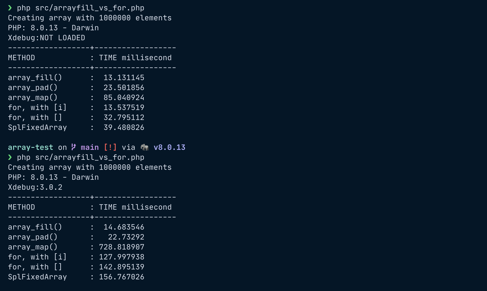

# Array PHP tests

A couple of script to measure the time and memory consumption with arrays in PHP.

```shell
php src/arrayfill_vs_for.php
```




```shell
composer install
php src/test.php
```
with test.php, you need to run *composer install* beacuse of usage of Arr php package.


## Resources:

- Great article about memory usage by an array in PHP: https://www.npopov.com/2011/12/12/How-big-are-PHP-arrays-really-Hint-BIG.html
- My Arr package: https://github.com/Hi-Folks/array
- hrtime() function: https://www.php.net/manual/en/function.hrtime.php
- memory_get_usage() function: https://www.php.net/manual/en/function.memory-get-usage
- unset function(): https://www.php.net/manual/en/function.unset.php

